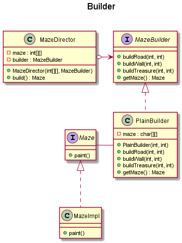
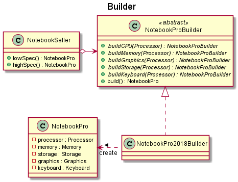

# Builder 建造者模式
> 用 OOP 的方式來解決一個不同 (複雜) 物件的創造。目的是為了要分離一個複雜物品的建造和表示建造的方式。

## 圖例
- Maze Builder

- Notebook Builder

## 真實使用案例
> Reference to [Github/iluwatar/java-design-pattern](https://github.com/iluwatar/java-design-patterns)

- [Builder](https://github.com/iluwatar/java-design-patterns/tree/master/builder#real-world-examples)
