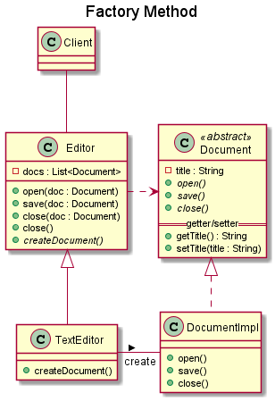

# Factory 工廠模式
> 提供一個建立一系列相關或互相依賴物件的介面，而無需指定它們具體的類別。

工廠模式有下列幾種
1. Simple Factory
1. Abstract Factory
1. Factory Method

## 圖例
### Simple Factory

### Abstract Factory
- Car Factory

- Draw Rectangle
 

### Factory Method

## 真實使用案例
> Reference to [Github/iluwatar/java-design-pattern](https://github.com/iluwatar/java-design-patterns)

- [Abstract Factory](https://github.com/iluwatar/java-design-patterns/tree/master/abstract-factory#real-world-examples)
- [Factory Method](https://github.com/iluwatar/java-design-patterns/tree/master/factory-method#real-world-examples)
