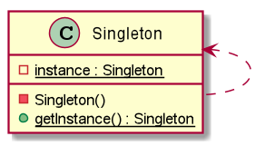

# Singleton 單例模式
> 只有一個實例，而且自行實例化並向整個系統提供這個實例。

實現 Singleton 常用方式：
1. Lazy Initialization 懶散模式 (Not thread-safely)
1. Lazy Initialization 懶散模式 (Thread-safely)
1. Double CheckLock 雙重鎖
1. 登記式

## 圖例

## 真實使用案例
> Reference to [Github/iluwatar/java-design-pattern](https://github.com/iluwatar/java-design-patterns)

- [Singleton](https://github.com/iluwatar/java-design-patterns/tree/master/singleton#real-world-examples)
