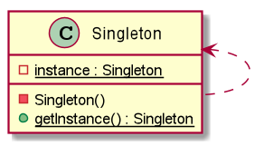

# Singleton 單例模式
> 只有一個實例，而且自行實例化並向整個系統提供這個實例。

實現 Singleton 常用方式：
1. Lazy Initialization 懶散模式 (Not thread-safely)
1. Lazy Initialization 懶散模式 (Thread-safely)
1. Double CheckLock 雙重鎖
1. 登記式

## 圖例

## 真實使用案例
* [java.lang.Runtime#getRuntime()](http://docs.oracle.com/javase/8/docs/api/java/lang/Runtime.html#getRuntime%28%29)
* [java.awt.Desktop#getDesktop()](http://docs.oracle.com/javase/8/docs/api/java/awt/Desktop.html#getDesktop--)
* [java.lang.System#getSecurityManager()](http://docs.oracle.com/javase/8/docs/api/java/lang/System.html#getSecurityManager--)
